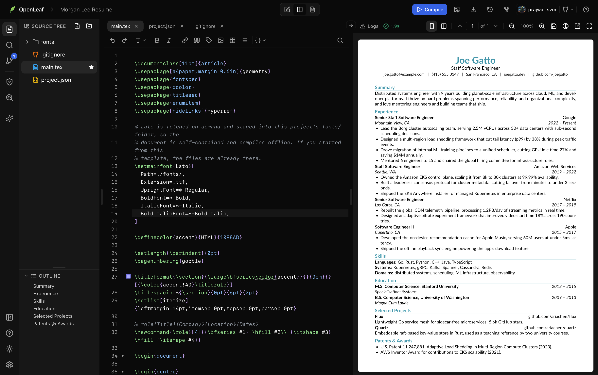
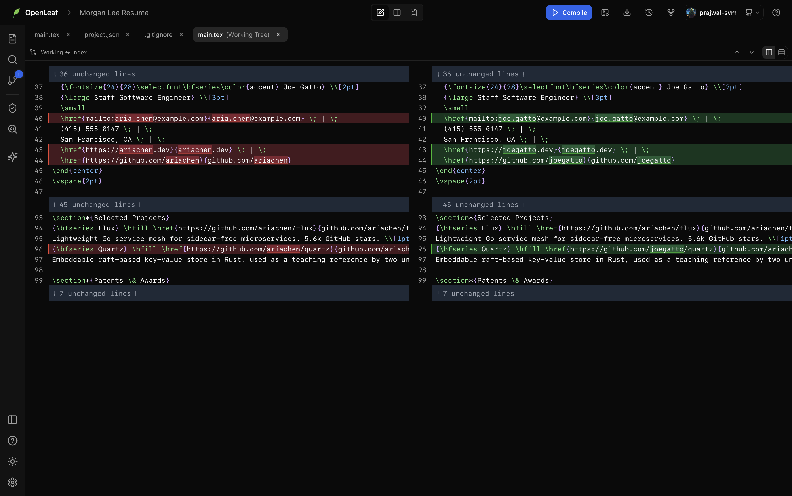
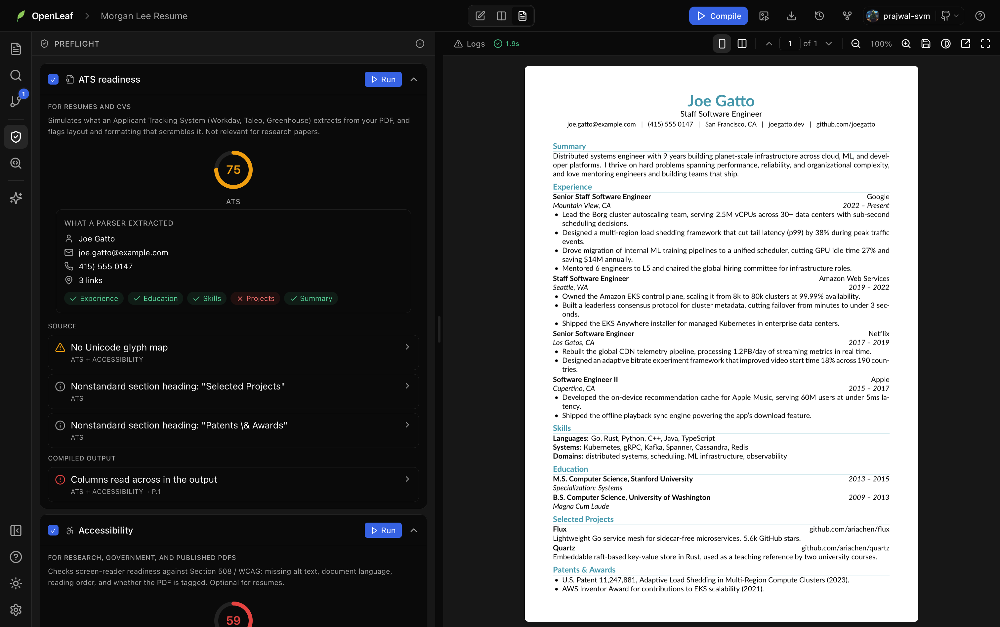
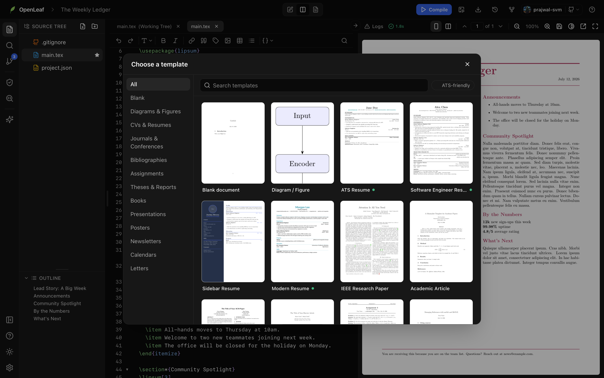

<div align="center">


# Oleafly

### Cursor for research papers and resumes. Runs entirely on your machine.

**Oleafly is a free, open-source, AI-native LaTeX studio for macOS, Windows, and Linux. No account, no cloud, no TeX install.** Every successful compile becomes a Git commit. The AI doesn't stop at editing: it compiles your document and reads the PDF to verify its own edit. Bring your own key, run a local model, or turn it off.

*Documents should outlive services.*

[](https://github.com/Oleafly/Oleafly/releases/latest)
[](https://github.com/Oleafly/Oleafly/releases)
[](https://github.com/Oleafly/Oleafly/actions/workflows/ci.yml)
[](LICENSE)
[](https://github.com/Oleafly/Oleafly/releases/latest)
[](https://github.com/Oleafly/Oleafly)

</div>

<br/>

<div align="center">

</div>

<br/>

<div align="center">

**[Download the app](https://github.com/Oleafly/Oleafly/releases/latest) · [Build from source](docs/install.md) · [Docs](https://oleafly.com/docs/)**

Grab a prebuilt installer for macOS, Windows, or Linux from the [latest release](https://github.com/Oleafly/Oleafly/releases/latest), or [build it from source](docs/install.md).

If Oleafly is useful to you, a star helps other people find it.

</div>

> [!NOTE]
> **Status:** Oleafly is already usable for real projects. Some advanced workflows and package compatibility are still evolving. [Feedback and bug reports](https://github.com/Oleafly/Oleafly/issues) are welcome.

<br/>

<table align="center">
<tr>
<td width="50%"><p align="center"><b>⌘/Ctrl-click the PDF, jump to the source</b></p></td>
<td width="50%"><p align="center"><b>Resumes work out of the box</b></p></td>
</tr>
<tr>
<td colspan="2" align="center"><p align="center"><b>Let the AI fix a LaTeX error</b></p></td>
</tr>
</table>

<br/>

## Who it's for

- **Students.** Write assignments, reports, and a thesis without installing a full TeX distribution. The compiler ships inside the app.
- **Researchers.** Manage large multi-file papers with citations, cross-references, Git commit history, and an AI that reads the whole project.
- **Job seekers.** Build ATS-friendly LaTeX resumes, tailor them to job descriptions, and keep every version of every variant.
- **Developers.** Documents as plain files in real Git repos, synced to GitHub, open in any editor. LaTeX treated like code.

<br/>

## Install

**Download the app** from the [latest release](https://github.com/Oleafly/Oleafly/releases/latest):

| Platform | Grab |
|---|---|
| macOS (Apple Silicon) | `.dmg` |
| Windows | `.msi` or `-setup.exe` |
| Linux | `.AppImage`, `.deb`, or `.rpm` |

Builds aren't code-signed yet, so your OS warns on first launch (it's safe to open). One-time unlock: on macOS run `/usr/bin/xattr -dr com.apple.quarantine /Applications/Oleafly.app`; on Windows click **More info**, then **Run anyway**; on Linux `chmod +x` the AppImage.

**Or build from source:**

```bash
git clone https://github.com/Oleafly/Oleafly.git && cd Oleafly
./scripts/fetch-tectonic.sh all   # LaTeX compiler sidecar
./scripts/fetch-typst.sh all      # Typst compiler sidecar
pnpm install
pnpm tauri dev
```

Prerequisites and production builds are in the [install guide](docs/install.md).

<br/>

## Why Oleafly

Oleafly isn't trying to recreate Overleaf on the desktop. It's built around a different idea: technical documents deserve the same AI, Git, and local-first workflows that developers expect from modern code editors. This is document engineering.

- It compiles on your machine. No server, no upload queue, no account.
- Your files live in a plain folder on your disk. Nothing leaves it unless you tell it to.
- Every project is a Git repo; every successful compile becomes a commit.
- AI is optional. Plug in your own key, or run a local model with Ollama, or turn it off.
- The files are just `.tex`, `.bib`, and images. Open them in any other editor whenever you want.
- It works with no internet at all.

You get the polish of a cloud editor without handing your documents to one.

You can assemble most of these features yourself with VS Code extensions, Git, Copilot, TeX Live, PDF viewers, ATS tools, and scripts. Oleafly integrates them into one application that works out of the box.

**And while it's at it, Oleafly quietly replaces the rest of your stack: the paid resume builder, the ATS checker, the accessibility auditor, the Git client, and the AI copilot subscription.**

<br/>

## What makes it different

**Every compile becomes a Git commit.** Undo a paragraph from yesterday. Compare two versions side by side. Branch your resume before every interview. Push it to GitHub with one click. No plugin, no setup, no `resume_final_v3_FINAL.tex`.

This is Oleafly's superpower. Every project is a real Git repo on your disk: the app commits your work automatically (after every successful compile, and shortly after you stop editing) and gives you history, diffs, and one-click restore right in the UI. And because it's real Git, `git log` and `git blame` work from a terminal too.

<div align="center">

</div>

**Local, bring-your-own AI.** OpenAI, Anthropic, Groq, OpenRouter, DeepSeek, Mistral, xAI, Z.AI, or a local model through Ollama. Your prompts and documents don't touch a third party unless you pick one that does.

**MCP server.** Connect Claude Desktop, Claude Code, Cursor, or any MCP client and let it edit and compile your project with per-change approval. See [docs/mcp.md](docs/mcp.md).

**Everything on disk.** No blob store, no lock-in. A project is just `~/.oleafly/projects/<id>/`, a normal folder with a real `.git` inside.

<br/>

## Philosophy

> **Documents should outlive services.**
>
> Your thesis shouldn't disappear because a company shuts down.
>
> Your resume shouldn't require a subscription.
>
> Your research shouldn't depend on an internet connection.
>
> Your files belong to you.

<br/>

## How it compares

Oleafly sits where four product categories overlap: LaTeX editors, cloud writing platforms, resume builders, and AI copilots. Here's the honest matrix.

| | &emsp;&emsp;Oleafly&emsp;&emsp; | &emsp;&emsp;Overleaf&emsp;&emsp; | &emsp;TeXstudio / TeXmaker&emsp; | &emsp;VS Code + LaTeX Workshop&emsp; | &emsp;&emsp;Typst (web)&emsp;&emsp; | &emsp;Word / Google Docs&emsp; | &emsp;Resume builders (Zety · Rezi · Novoresume · Enhancv)&emsp; |
|---|:---:|:---:|:---:|:---:|:---:|:---:|:---:|
| Price | Free, open source | Free tier; subscription for full history, sync, AI | Free | Free (AI needs paid Copilot) | Free tier; subscription for teams | Subscription (Word) / free (Docs) | Subscription; downloads often paywalled |
| Real LaTeX output | Yes | Yes | Yes | Yes | No (its own markup) | No | No |
| Works fully offline | Yes | No | Yes | Yes | Partly (CLI only) | Partly | No |
| Zero LaTeX setup (no TeX install) | Yes, engine bundled | Yes (cloud) | No (multi-GB TeX Live / MiKTeX) | No (bring your own TeX + config) | Yes | n/a | n/a |
| Files stay on your disk | Yes | No | Yes | Yes | No | Partly | No |
| Version history | Real Git, automatic commits, diffs, one-click restore | Paid feature | Manual | Manual | Limited | Limited | No |
| Push to GitHub | One click | Paid sync | Manual | Manual | No | No | No |
| AI assistant | Built in: 9 providers, bring your own key or local Ollama | Paid add-on | None | Paid Copilot | None | Copilot / Gemini subscription | Upsell |
| AI edits gated by approval diffs | Yes, every file change | No | n/a | No | n/a | No | No |
| AI compiles and verifies its own edits | Yes | No | n/a | No | n/a | n/a | n/a |
| ATS resume checks | Yes, scored, with a parser's-eye preview | No | No | No | No | No | Claimed, methodology opaque |
| Accessibility checks (Section 508 / PDF/UA) | Yes, plus tagged PDF export | No | No | No | No | Basic checker (Word) | No |
| Click PDF to jump to source (SyncTeX) | Yes, word-level, both directions | Yes | Yes | Yes | Preview jump | n/a | n/a |
| Template gallery | Built in: resumes, papers, theses, posters, decks | Large community gallery | A few | No | Community packages | Yes | Yes |
| Account required | No | Yes | No | No | Yes | Yes | Yes |
| Open source | Yes (AGPL) | Partly (server core) | Yes | Mostly | Compiler only | No | No |

Different tools, different bets. Oleafly's is that your documents belong on your machine, in Git, with AI you control and give access to. The ATS and accessibility rows aren't a typo, by the way. We looked for those checks in other LaTeX editors, paid and free, and came up empty.

<br/>

## Resume mode

Most LaTeX tools treat resumes as an afterthought. Oleafly doesn't.

- ATS-friendly by default. XeTeX with embedded fonts means the PDF parses cleanly in applicant-tracking systems.
- One-page templates that actually stay one page.
- Branch your resume: a `faang` branch, a `startup` branch, a `research` branch. Switch between them instantly.
- Paste a job posting and let the AI tailor your bullets to it.
- The PDF renders the same everywhere, so there are no "looked fine on my screen" surprises.

Version-control your career. One repo, every variant of you.

<div align="center">

</div>

<br/>

## Research mode

The same engine that builds your resume handles serious academic work: papers, theses, CVs, books, articles, and grant proposals.

Multi-file projects, `\input` trees, `.bib` bibliographies, figures, and cross-references all work, with SyncTeX keeping the source and PDF in lockstep.

<br/>

## Accessible and ATS-ready, checked before you submit

Most LaTeX looks fine to a human and falls apart for a machine reader. A two-column layout reads across in a screen reader. An icon font hides your email from a resume parser. An untagged PDF fails Section 508 and PDF-UA outright. Oleafly catches all of this while you write, not after a rejection.

Open the Preflight panel and it scores your document out of 100 for the two audiences that fail on the same defects: applicant-tracking systems (ATS) and screen readers. It reads your source and your compiled PDF and shows you exactly what a machine sees.

- **ATS readiness.** A simulation of what an applicant-tracking system pulls from your resume PDF: name, email, phone, links, and which standard sections (Experience, Education, Skills) it detected, so you catch a section a parser can't see before a recruiter does.
- **Accessibility.** A Section 508 / PDF-UA verdict with a full tag-tree audit, plus source checks for multi-column layouts, missing image alt text, skipped heading levels, undescriptive links, and missing document language or title.
- **What the reader sees.** A plain-text preview of your compiled PDF in reading order, the exact thing a screen reader or parser gets.
- **One-click accessible export.** Oleafly rewrites your source with the setup a tagging engine needs and shows every change first. Compile with LuaLaTeX (use a TeX Live you already have, or install TinyTeX on demand, no admin rights) to produce a tagged, Section 508 / PDF-UA oriented PDF, then verify it right there.

<div align="center">

</div>

Every check is documented in [the Preflight guide](https://oleafly.com/docs/preflight/).

<br/>

## AI that understands LaTeX

Most AI editors stop after editing. Oleafly's assistant closes the loop: it reads your files, edits the source, compiles, and then reads the resulting PDF to check that the edit actually worked. And every file-changing edit pauses for your approval with a red/green diff, so nothing touches your document without you seeing it first.

<div align="center">

</div>

It also draws figures. Describe a diagram (or select a paragraph), and it generates the LaTeX, compiles just the figure in isolation, looks at the rendered result to fix overlaps and spacing, and inserts editable TikZ at your cursor. No AI key? A manual Figure Playground compiles and inserts figures offline.

| | |
|---|---|
| Explain a cryptic error | Rewrite a paragraph |
| Fix your bibliography | Suggest citations |
| Sharpen resume bullets | Tailor to a job description |
| Generate tables | Generate TikZ diagrams |
| Clean up formatting | Summarize a paper |

<br/>

## Features

The full list. Everything here runs on your machine. For the detailed tour, see the [documentation site](https://oleafly.com/docs/).

**Editor (CodeMirror 6)**
- LaTeX autocomplete for commands, `\ref`/`\label`, `\cite` (parsed from your `.bib`), and file names from the tree
- Slash commands: type `/` for a Notion-style insert menu (`/figure`, `/table`, `/section`, `/cite`, `/math`)
- Find and replace (`⌘F`) with case, whole-word, and regex toggles, a live match count, and preserve-case replace; go to line with `⌘⇧L`
- Code folding for `\begin…\end` environments and section trees
- Vim mode, toggleable in Settings
- Offline spellcheck (Hunspell WASM) and grammar (Harper), masking commands, math, and comments so only prose is checked
- Compile errors surface as inline red squiggles and gutter marks

**Code intelligence (whole-project, not just the open file)**
- Go to definition (F12 or Cmd/Ctrl-click) for `\ref`, `\cite`, `\gls`, custom macros, and environments, across files
- Find references (Shift-F12) lists every use in a side panel
- Rename symbol (F2) updates a label, citation key, or macro everywhere at once, and warns on clashes
- Hover a `\ref`, `\cite`, or macro to see where it's defined
- The AI can read a project map (outline, labels, citations, macros, file graph)

**Compile and PDF**
- Tectonic (XeTeX) runs as a bundled sidecar, producing ATS-clean output with embedded subset fonts
- Debounced auto-compile (~2.5s) plus manual recompile with `⌘↵`
- Offline mode compiles with `--only-cached` and never touches the network
- pdf.js viewer with continuous scroll, single-page or two-page (spread) layouts, zoom (buttons or trackpad pinch), fit-to-width/height, page navigation (current/total, prev/next, jump-to), presentation mode, and an invert-colors toggle
- Bidirectional SyncTeX: Cmd/Ctrl-click a word in the PDF to land on that exact word in the source, or jump source-to-PDF with `⌘⇧J`
- The viewer is virtualized, so it stays smooth on documents hundreds of pages long (a thesis or a book)

**Preflight: ATS and accessibility checks**
- Two scores out of 100: ATS readiness and accessibility
- Source checks for multi-column layouts, missing image alt text, icon-hidden contact info, layout tables, skipped heading levels, undescriptive links, missing document language or PDF title, and more
- Output checks (after compiling) for reading order, garbled or unmapped text, and pages with no selectable text
- Plain-text preview of what a parser or screen reader actually sees, plus a simulated ATS extraction for resumes
- Reference and asset checks for undefined citations, duplicate labels, duplicate bib entries, and missing includes
- Prepare-for-accessible-export rewrites your document with the tagging setup a LuaLaTeX engine needs, showing every change first
- Optional LuaLaTeX engine: use an existing TeX Live or install TinyTeX (about 100 MB) on demand to compile and verify a tagged, Section 508 / PDF-UA oriented PDF

**Projects, files, and history**
- Library home with thumbnails, engine labels, last-edited time, project details, export history, metadata search, and advanced filters
- Progressive, persisted tours for Home, the project workspace, Settings, AI Assistant, and Diagram Composer
- Searchable keyboard reference plus safe, customizable application shortcuts in Settings
- Template gallery on new-project: browse by category with search, an ATS-friendly filter, and a live preview of each template. The starter set spans ATS-friendly resumes, a polished software engineer resume, a Modern resume in Lato, a photo-and-sidebar design resume, a full IEEE paper, ACM and Elsevier articles, a minimalist academic article, a thesis/report, a book, a Beamer deck, a research poster, a homework assignment, a newsletter, a monthly calendar, a bibliography starter, and a formal letter.
- On-demand fonts: templates that use premium open-source fonts (Lato, PT Sans, PT Serif) download them only when needed and copy them into the project, so the app stays small and documents stay self-contained. Manage downloads in Settings, Offline & Downloads.

<div align="center">

</div>

- Source tree: create files and folders (nested to any depth), rename, delete, duplicate (files and whole folders), and reorganize by drag and drop; right-click a folder to add a file or folder inside it; upload files and set the main document
- Multi-file support for `\input`, images (PNG/JPG/PDF/EPS), and `.bib`, with editor tabs
- Autosave to disk shortly after you stop typing
- Every project is a Git repo with automatic commits (after successful compiles, and shortly after you stop editing), a full history view, side-by-side diffs, and one-click restore

**Source control and sync**
- Stage or discard changes, write a message, and Commit, Push, or Pull
- Publish to GitHub (new or existing repo) with ahead/behind indicators

<div align="center">

</div>


**Citations**
- Paste a DOI, arXiv id, or URL to fetch an entry, or search Crossref by title
- Oleafly appends a correctly-keyed BibTeX entry (deduplicated by DOI) and inserts the `\cite` at your cursor
- Lookups send only the identifier or title, and respect offline mode

**AI assistant (bring your own model)**
- Reads and writes files, find-and-replace, create, rename, delete
- Compiles, reads the log, and extracts PDF text to verify its own edits
- Searches across projects, sets the main doc, toggles the theme
- Every file-changing edit pauses for approval with a red/green diff, and the decision stays in the chat
- Custom instructions, sandboxed so they can't reveal or override the built-in prompt
- Providers: OpenAI, Anthropic, Groq, OpenRouter, DeepSeek, Mistral, xAI, Z.AI, or local Ollama

**Templates, deadlines, and growth**
- Template packs downloaded on demand from an open catalog
  (github.com/Oleafly/template-packs): journal and conference classes
  (REVTeX, ACS, Elsevier, ACM), resume and CV expansions, slides and
  posters. The catalog grows without app updates.
- Generate a template with AI: describe the document, preview the compiled
  result, and save it as a permanent gallery entry
- Conference deadlines browser with live countdowns, field filters, and
  search, fed by the open ccf-deadlines dataset

**Import and export**
- Import: Word (`.docx`) via Pandoc, PDF to LaTeX through a built-in local
  converter (runs entirely on your machine, no AI required) with optional AI
  refinement, and photo-of-equation to LaTeX with a vision model
- PDF export (always ATS-clean) and source-as-`.zip`
- First-class Markdown projects compile to PDF through Pandoc and the bundled
  Tectonic engine. Word (.docx), HTML, and Markdown export use the same Pandoc
  installation, downloaded on demand or installed separately
- Light and dark themes with Geist tokens, following your system setting
- Command palette (`⌘K`) to fuzzy-search every action
- In-app version display and update checker
- Full offline mode, no account, no telemetry

<br/>

## Architecture

The frontend is a pnpm workspace: nine `@oleafly/*` engine packages (editor, preview, diagram, preflight, AI tools, templates, …) behind injected ports, wired into the app shell through a contribution registry. The deep dive is in [docs/architecture.md](docs/architecture.md).

```mermaid
flowchart TB
  subgraph FE["FRONTEND · System WebView (WKWebView / WebView2 / WebKitGTK) · React 19 + TS"]
    direction TB
    UI["React UI runtime<br/>Zustand stores · Tailwind v4 · router"]
    CM["CodeMirror 6 editor<br/>LaTeX language · autocomplete (ref/cite) · Vim"]
    IDX["Code intelligence<br/>project index · outline / labels / cites / macros · go-to-def · rename"]
    LINT["Language checks (WASM)<br/>latex-mask → Harper grammar + Hunspell spell"]
    PDF["PDF viewer<br/>pdf.js + web worker · virtualized · SyncTeX overlay"]
    PRE["Preflight<br/>ATS + a11y rules · pdf.js text extract · tag-tree audit"]
    AICHAT["AI assistant<br/>Vercel AI SDK · agent tool-loop · approval gate"]
    IPCC["Tauri IPC client<br/>invoke() · event('compile:log')"]
    UI --> CM
    CM --> LINT
    CM --> IDX
    UI --> PDF
    UI --> PRE
    UI --> AICHAT
    AICHAT --> IDX
    UI --> IPCC
  end

  IPC["TAURI IPC BRIDGE<br/>serialize args · route commands · the only trust boundary"]

  subgraph BE["RUST CORE · Tauri backend · owns disk, processes &amp; secrets"]
    direction TB
    ROUTER["Command router<br/>#tauri::command handlers · tokio async runtime"]
    PATHS["Path sandbox<br/>resolve_within · reject abs / .. / symlink · per-project id"]
    PROJ["Project + FS store<br/>CRUD · full-text search · bundled template gallery · zip / pandoc export"]
    ASSETS["On-demand assets<br/>font packs (font-packs.json) · shared cache · copied into projects"]
    COMPILE["Compile orchestrator<br/>tectonic_args · entry wrapper · log → errors · raw-bytes PDF"]
    TAG["Tagging engine (opt-in)<br/>LuaLaTeX via system TeX Live or TinyTeX · tlmgr · PDF/UA"]
    SYNC["SyncTeX engine<br/>gunzip .synctex.gz · forward + inverse mapping"]
    GIT["Git engine<br/>auto-commit · diff · restore · push / pull"]
    GHAPI["GitHub module<br/>REST (reqwest) + OAuth device flow"]
    CITE["Citation lookup<br/>async reqwest · DOI / arXiv / Crossref"]
    CFG["Config store @ 0600<br/>GitHub token + AI keys · never returned to webview"]
    UPD["Updater<br/>minisign verify → install → relaunch"]
    ROUTER --> PATHS
    PATHS --> PROJ
    ROUTER --> ASSETS
    ROUTER --> COMPILE
    ROUTER --> TAG
    ROUTER --> SYNC
    ROUTER --> GIT
    ROUTER --> GHAPI
    ROUTER --> CITE
    ROUTER --> CFG
    ROUTER --> UPD
  end

  TEC["Tectonic sidecar<br/>XeTeX engine · bundled externalBin"]
  TEX["LuaLaTeX engine<br/>system TeX Live or on-demand TinyTeX (~100MB)"]
  GITBIN["git subprocess<br/>env-backed credential helper"]
  DISK["Local disk<br/>~/.oleafly · projects/&lt;id&gt; with real .git repos · font cache"]
  GHREMOTE["GitHub<br/>api.github.com + git remote"]
  CITEHOSTS["Citation sources<br/>doi.org · arXiv · Crossref"]
  FONTSRC["Font sources<br/>google/fonts (open-license TTFs)"]
  PROV["AI providers<br/>8 providers (OpenAI · Anthropic · Groq · …) + local Ollama"]
  FEEDS["Update feed<br/>GitHub Releases · latest.json + .sig"]

  IPCC -->|"invoke(cmd, args)"| IPC
  IPC -->|"Result · emit events"| IPCC
  IPC ==> ROUTER

  COMPILE -->|"spawn -X compile --synctex"| TEC
  TEC -->|"PDF · .log · .synctex.gz"| COMPILE
  TAG -->|"spawn lualatex · tagged output"| TEX
  TEX -->|"tagged PDF · .log"| TAG
  PROJ --> DISK
  ASSETS -->|"download once · verify"| FONTSRC
  ASSETS --> DISK
  GIT --> GITBIN
  GITBIN --> DISK
  GITBIN -->|"push / pull · token via env"| GHREMOTE
  GHAPI -->|"Bearer token · Rust-side only"| GHREMOTE
  CITE -->|"GET · BibTeX / Atom / JSON"| CITEHOSTS
  UPD -->|"GET latest.json · verify .sig"| FEEDS
  AICHAT -.->|"streamText · direct"| PROV
  AICHAT -.->|"tool calls: read / edit / compile"| IPCC

  classDef fe fill:#e0f2fe,stroke:#0284c7,stroke-width:1px,color:#0c4a6e;
  classDef be fill:#fef3c7,stroke:#d97706,stroke-width:1px,color:#7c2d12;
  classDef ext fill:#dcfce7,stroke:#16a34a,stroke-width:1px,color:#14532d;
  classDef bound fill:#fee2e2,stroke:#dc2626,stroke-width:2px,color:#7f1d1d;

  class UI,CM,IDX,LINT,PDF,PRE,AICHAT,IPCC fe;
  class ROUTER,PATHS,PROJ,ASSETS,COMPILE,TAG,SYNC,GIT,GHAPI,CITE,CFG,UPD be;
  class TEC,TEX,GITBIN,DISK,GHREMOTE,CITEHOSTS,FONTSRC,PROV,FEEDS ext;
  class IPC bound;

  style FE fill:none,stroke:#0284c7,stroke-width:2px,color:#0c4a6e;
  style BE fill:none,stroke:#d97706,stroke-width:2px,color:#7c2d12;
```



Oleafly is local-first. A React webview draws the UI, a Rust core owns every
disk, process, and network call, and a bundled Tectonic engine does the
typesetting. The two halves only talk over Tauri's IPC, so nothing in the webview
reaches the filesystem or the network on its own.

**The core is the security boundary.** Every file the UI or the AI touches goes
through one Rust path guard. It rejects absolute paths, `..` traversal, and
symlink escapes, and it's scoped to a single project, so a crafted path or id
can't read or write outside its own folder. The GitHub token never reaches the
webview and never shows up in a git command's arguments; pushes authenticate
through an env-backed credential helper, and the config file is written
atomically at `0600`.

**Compiling.** A compile spawns the Tectonic (XeTeX) sidecar against a generated
wrapper that neutralizes pdfLaTeX-only primitives, streams the live TeX log to
the editor as it runs, parses the `.log` into structured errors, and hands back
the PDF as raw bytes. A companion SyncTeX layer reads the gzip-compressed
`.synctex.gz` and maps source to PDF both ways, so you can Cmd/Ctrl-click the PDF
to land on the source line, or move the cursor to highlight the rendered box.

**Checking prose without a LaTeX parser.** Grammar and spelling run entirely
offline (Harper and Hunspell, both WASM). The trick is masking: commands, math,
and comments get replaced with spaces before the checker sees the text, so it
only ever reads prose. An offset map then projects each finding back onto the
real source position.

**Understanding the whole project.** Oleafly keeps a live index of every file:
sections, labels, `\ref`/`\cite` uses, `.bib` keys, macros, and the `\input`
graph. It rebuilds incrementally as you type, so go-to-definition,
find-references, and project-wide rename work across files without a compile, and
the AI reads the same map instead of guessing from the open file alone.

**Preflight and tagged export.** A separate rules engine scores a document for
resume parsers (ATS) and screen readers. Source rules read the `.tex`; output
rules extract the compiled PDF's text and structure with pdf.js and audit its tag
tree. For real PDF/UA output there's an opt-in path that compiles with LuaLaTeX
(a system TeX Live, or an on-demand TinyTeX that installs to your home folder),
since the default Tectonic engine is XeTeX and can't emit tags.

**Templates and fonts.** The template gallery ships as bundled resources, so it
works offline on first launch. Templates that use richer open-source fonts
declare them in a manifest; the fonts download once into a shared cache and get
copied into the project itself, so the app stays small and every document stays
self-contained and compiles offline.

**The AI agent.** The assistant is a multi-step tool loop, with your own OpenAI
or Anthropic key (or a local Ollama host, no key needed), that reads files, edits, compiles, and then reads
the rendered PDF text to check whether the edit actually worked. It commits a git
checkpoint before it touches anything, and any destructive change waits for your
approval before it hits disk.

**Shipping.** Builds go out for macOS, Windows, and Linux with a minisign-signed
update feed the app verifies before it installs anything.


Plus Tectonic (XeTeX), pdf.js, Zustand, Harper, and Hunspell.

<br/>

## Documentation

The full product documentation lives at **[oleafly.com/docs](https://oleafly.com/docs/)**: thirty-plus guides that cover every feature, from first launch to tagged PDF export.

| Guide | What's inside |
|---|---|
| [Download](https://github.com/Oleafly/Oleafly/releases/latest) | Prebuilt installers (.dmg / .msi / .exe / .AppImage / .deb / .rpm) |
| [Overview](https://oleafly.com/docs/overview/) | What Oleafly is and a tour of the whole app |
| [Getting started](https://oleafly.com/docs/getting-started/) | First project to first PDF in a couple of minutes |
| [Templates](https://oleafly.com/docs/templates/) | The full gallery: resumes, papers, theses, posters, decks |
| [Preflight: ATS & accessibility](https://oleafly.com/docs/preflight/) | Section 508 / PDF-UA and resume-parser checks, before you submit |
| [AI assistant](https://oleafly.com/docs/ai-setup/) | Connect a model, or go local with Ollama |
| [MCP server](docs/mcp.md) | Drive Oleafly from Claude Desktop, Claude Code, Cursor, and other MCP clients |
| [GitHub sync](https://oleafly.com/docs/github-sync/) | Back up and sync across machines |
| [Keyboard shortcuts](https://oleafly.com/docs/keyboard-shortcuts/) | The ones worth memorizing |
| [FAQ](https://oleafly.com/docs/faq/) | Common questions and fixes |
| [Build from source](docs/install.md) | For developers: clone, install deps, run |
| [Development](docs/development.md) | Setup and how to contribute |
| [Frontend architecture](docs/architecture.md) | The `@oleafly/*` packages, ports, and the contribution registry |
| [Auto-updates](docs/updates.md) | How releases sign & ship in-app updates (maintainers) |

<br/>

## Contributing

Bug reports, features, templates, docs, and screenshots are all welcome. Have an idea? [Open a discussion](https://github.com/Oleafly/Oleafly/discussions).

1. Read [CONTRIBUTING.md](CONTRIBUTING.md) to get a dev build running.
2. Open an issue for big changes. Small fixes can go straight to a PR.
3. Run `pnpm build` and `cargo test --lib` (in `src-tauri/`) before submitting.

Found a security issue? Report it privately, see [SECURITY.md](SECURITY.md). Everyone taking part is expected to follow our [Code of Conduct](CODE_OF_CONDUCT.md).

<br/>

## Credits

Built on [Tectonic](https://tectonic-typesetting.github.io/), [Tauri](https://tauri.app/), [CodeMirror](https://codemirror.net/), [pdf.js](https://mozilla.github.io/pdf.js/), [React](https://react.dev/), [Zustand](https://github.com/pmndrs/zustand), [Tailwind CSS](https://tailwindcss.com/), [Geist](https://vercel.com/geist/introduction), [Harper](https://writewithharper.com/), and [Hunspell](https://hunspell.github.io/).

**License:** [AGPL-3.0-or-later](LICENSE) © 2026 Prajwal S Venkateshmurthy and contributors. Oleafly is free and open source: use, study, modify, and share it freely. The AGPL's network copyleft means anyone who runs a modified version (including as a hosted service) must make their source available under the same license. Bundled open-source components are listed in [THIRD_PARTY_LICENSES](THIRD_PARTY_LICENSES.md).
