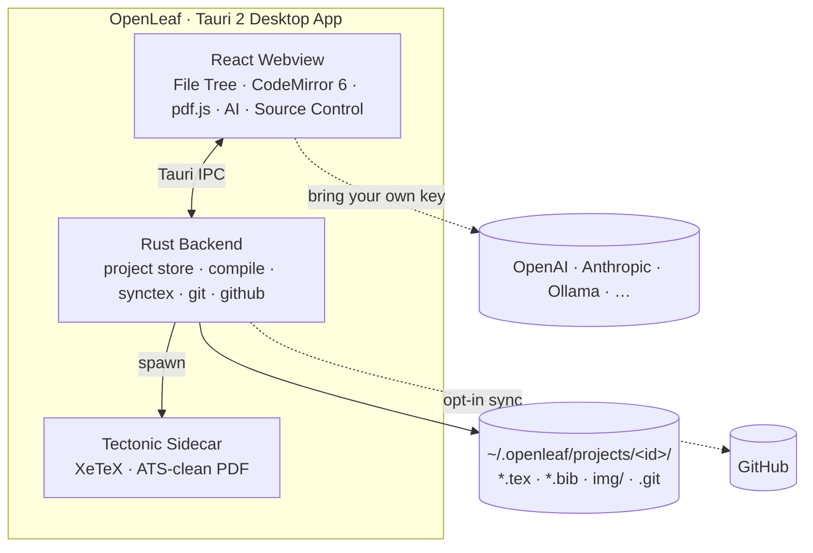

# OpenLeaf

### A LaTeX and resume editor that runs on your machine.

Your files stay on your disk. Every project is a real Git repo. Bring your own AI, or use none.

 

 

<table align="center">
<tr>
<td width="50%">
<b>Click the PDF, jump to the source</b>
</td>
<td width="50%">
<b>Let the AI fix a LaTeX error</b>
</td>
</tr>
<tr>
<td width="50%">
<b>Every save is a Git commit</b>
</td>
<td width="50%">
<b>Resumes work out of the box</b>
</td>
</tr>
</table>

**[Install](docs/install.md) · [Docs](docs) · [Roadmap](#roadmap)**

If OpenLeaf is useful to you, a star helps other people find it.

 

---

## Why OpenLeaf

You write LaTeX the way you write code, so your editor should treat it that way.

- It compiles on your machine. No server, no upload queue, no account.
- Your files live in a plain folder on your disk. Nothing leaves it unless you tell it to.
- Every project is a Git repo, and every save is a commit.
- AI is optional. Plug in your own key, or run a local model with Ollama, or turn it off.
- The files are just `.tex`, `.bib`, and images. Open them in any other editor whenever you want.
- It works with no internet at all.

You get the polish of a cloud editor without handing your documents to one.

 

## What makes it different

**Git-backed history.** Every project is a Git repo. It auto-commits on save, shows side-by-side diffs, and restores any past version in one click. You can undo a change from three months ago, branch a resume, or blame a paragraph.

**Local, bring-your-own AI.** OpenAI, Anthropic, Groq, OpenRouter, DeepSeek, Mistral, xAI, or a local model through Ollama. Your prompts and documents don't touch a third party unless you pick one that does.

**Everything on disk.** No blob store, no lock-in. A project is just `~/.openleaf/projects/<id>/`, a normal folder with a real `.git` inside.

 

## Resume mode

Most LaTeX tools treat resumes as an afterthought. OpenLeaf doesn't.

- ATS-friendly by default. XeTeX with embedded fonts means the PDF parses cleanly in applicant-tracking systems.
- One-page templates that actually stay one page.
- Branch your resume: a `faang` branch, a `startup` branch, a `research` branch. Switch between them instantly.
- Paste a job posting and let the AI tailor your bullets to it.
- The PDF renders the same everywhere, so there are no "looked fine on my screen" surprises.

Version-control your career. One repo, every variant of you.

 

## Research mode

The same engine that builds your resume handles serious academic work: papers, theses, CVs, books, articles, and grant proposals.

It handles multi-file projects, `\input` trees, `.bib` bibliographies, figures, and cross-references, with SyncTeX keeping the source and PDF in lockstep.

 

## AI that understands LaTeX

The assistant can read your files, compile them, look at the resulting PDF, edit the source, and then check that its edit actually worked.

| | |
|---|---|
| Explain a cryptic error | Rewrite a paragraph |
| Fix your bibliography | Suggest citations |
| Sharpen resume bullets | Tailor to a job description |
| Generate tables | Generate TikZ diagrams |
| Clean up formatting | Summarize a paper |

 

## Features

Editing runs on CodeMirror 6, with LaTeX autocomplete for `\ref`, `\cite`, and file names, slash-commands, find and replace, Vim mode, and Hunspell spellcheck.

Compilation uses Tectonic (XeTeX) locally, with debounced auto-compile, `⌘↵` to recompile, and bidirectional SyncTeX.

Git support covers auto-commit on save, the full log, diffs, and one-click restore.

The AI panel supports 8+ providers plus local Ollama, and it can read, compile, and fix your document.

Resume support gives you ATS-clean output, one-page templates, and a branch per company.

For academic work there are multi-file projects, `.bib` bibliographies, figures, and cross-references.

You can export to PDF (always ATS-clean), and to Word, HTML, or Markdown through pandoc.

For privacy there's a full offline mode, no account, and no telemetry.

 

## Philosophy

> Your files belong to you.
>
> Every project is a folder. Every edit is Git history.
>
> No subscription and no account. Bring your own AI, or none at all.

 

## Architecture

Built with Tauri 2, React 19, TypeScript, CodeMirror 6, pdf.js, Tectonic, Zustand, Tailwind v4 with Geist, and Hunspell (WASM).

 

## Roadmap

Coming soon:
- [ ] Prebuilt signed installers (macOS notarized, Windows EV, Linux AppImage)
- [ ] Pre-warmed offline TeX bundle for a true zero-internet first run
- [ ] OS keychain storage for tokens

Ideas for later:
- [ ] Zotero and citation-manager integration
- [ ] Resume scoring against a job description
- [ ] Timeline playback of a document's history

Have an idea? [Open a discussion](https://github.com/prajwal-svm/OpenLeaf/discussions).

 

## Documentation

| Guide | What's inside |
|---|---|
| [Install](docs/install.md) | Get running from source |
| [Getting started](docs/getting-started.md) | First project to first PDF in a couple of minutes |
| [Features](docs/features.md) | The full tour |
| [AI assistant](docs/ai-assistant.md) | Connect a model, or go local with Ollama |
| [GitHub sync](docs/github-sync.md) | Back up and sync across machines |
| [Keyboard shortcuts](docs/keyboard-shortcuts.md) | The ones worth memorizing |
| [Development](docs/development.md) | Architecture and how to contribute |
| [Auto-updates](docs/updates.md) | How releases sign & ship in-app updates (maintainers) |
| [FAQ](docs/faq.md) | Common questions and fixes |

 

## Contributing

Bug reports, features, templates, docs, and screenshots are all welcome.

1. Read [CONTRIBUTING.md](CONTRIBUTING.md) to get a dev build running.
2. Open an issue for big changes. Small fixes can go straight to a PR.
3. Run `pnpm build` and `cargo test --lib` (in `src-tauri/`) before submitting.

Found a security issue? Report it privately, see [SECURITY.md](SECURITY.md). Everyone taking part is expected to follow our [Code of Conduct](CODE_OF_CONDUCT.md).

 

## Credits

Built on [Tectonic](https://tectonic-typesetting.github.io/), [Tauri](https://tauri.app/), [CodeMirror](https://codemirror.net/), [pdf.js](https://mozilla.github.io/pdf.js/), [React](https://react.dev/), [Zustand](https://github.com/pmndrs/zustand), [Tailwind CSS](https://tailwindcss.com/), [Geist](https://vercel.com/geist/introduction), [Harper](https://writewithharper.com/), and [Hunspell](https://hunspell.github.io/).

**License:** [Apache-2.0](LICENSE) © 2026 Prajwal S Venkateshmurthy and contributors.
