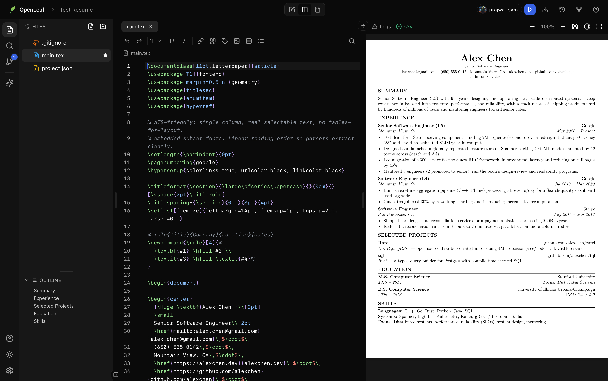
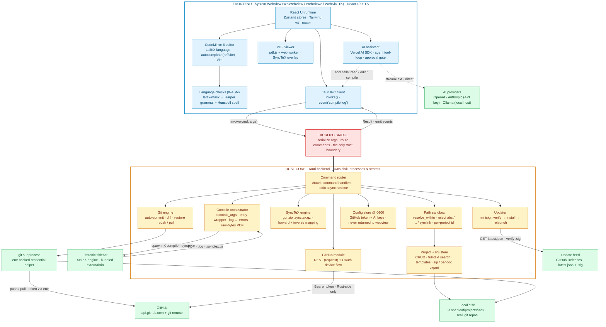

<div align="center">


# OpenLeaf

### A LaTeX and resume editor that runs on your machine.

Your files stay on your disk. Every project is a real Git repo. Bring your own AI, or use none.

[](https://github.com/prajwal-svm/OpenLeaf/releases/latest)
[](https://github.com/prajwal-svm/OpenLeaf/actions/workflows/ci.yml)
[](LICENSE)
[](https://github.com/prajwal-svm/OpenLeaf/releases/latest)
[]()
[](https://github.com/prajwal-svm/OpenLeaf)

</div>

<br/>

<div align="center">

</div>

<br/>

<div align="center">

**[Download the app](https://github.com/prajwal-svm/OpenLeaf/releases/latest) · [Build from source](docs/install.md) · [Docs](docs) · [Roadmap](#roadmap)**

Grab a prebuilt installer for macOS, Windows, or Linux from the [latest release](https://github.com/prajwal-svm/OpenLeaf/releases/latest), or [build it from source](docs/install.md).

If OpenLeaf is useful to you, a star helps other people find it.

</div>

<br/>

<table align="center">
<tr>
<td width="50%"><p align="center"><b>⌘/Ctrl-click the PDF, jump to the source</b></p></td>
<td width="50%"><p align="center"><b>Resumes work out of the box</b></p></td>
</tr>
<tr>
<td colspan="2" align="center"><p align="center"><b>Let the AI fix a LaTeX error</b></p></td>
</tr>
</table>

<br/>

## Install

**Download the app** from the [latest release](https://github.com/prajwal-svm/OpenLeaf/releases/latest):

| Platform | Grab |
|---|---|
| macOS (Apple Silicon) | `.dmg` |
| Windows | `.msi` or `-setup.exe` |
| Linux | `.AppImage`, `.deb`, or `.rpm` |

Builds aren't code-signed yet, so your OS warns on first launch (it's safe to open). One-time unlock: on macOS run `/usr/bin/xattr -dr com.apple.quarantine /Applications/OpenLeaf.app`; on Windows click **More info**, then **Run anyway**; on Linux `chmod +x` the AppImage.

**Or build from source:**

```bash
git clone https://github.com/prajwal-svm/OpenLeaf.git && cd OpenLeaf
./scripts/fetch-tectonic.sh all   # Tectonic compiler sidecar
pnpm install
pnpm tauri dev
```

Prerequisites and production builds are in the [install guide](docs/install.md).

<br/>

## Why OpenLeaf

You write LaTeX the way you write code, so your editor should treat it that way.

- It compiles on your machine. No server, no upload queue, no account.
- Your files live in a plain folder on your disk. Nothing leaves it unless you tell it to.
- Every project is a Git repo, and every save is a commit.
- AI is optional. Plug in your own key, or run a local model with Ollama, or turn it off.
- The files are just `.tex`, `.bib`, and images. Open them in any other editor whenever you want.
- It works with no internet at all.

You get the polish of a cloud editor without handing your documents to one.

<br/>

## What makes it different

**Git-backed history.** Every project is a Git repo. It auto-commits on save, shows side-by-side diffs, and restores any past version in one click. You can undo a change from three months ago, branch a resume, or blame a paragraph.

**Local, bring-your-own AI.** OpenAI, Anthropic, Groq, OpenRouter, DeepSeek, Mistral, xAI, or a local model through Ollama. Your prompts and documents don't touch a third party unless you pick one that does.

**Everything on disk.** No blob store, no lock-in. A project is just `~/.openleaf/projects/<id>/`, a normal folder with a real `.git` inside.

<br/>

## How it compares

| | OpenLeaf | Overleaf | VS Code + LaTeX Workshop |
|---|---|---|---|
| Works offline | Yes | No | Yes |
| Git built in | Yes | Add-on | Manual |
| Resume mode (ATS-clean, branchable) | Yes | Templates | No |
| AI assistant | Built-in · BYOK or local Ollama | Paid add-on | Extensions |
| Files stay on your disk | Yes | No | Yes |
| No account required | Yes | No | Yes |

Different tools, different bets. OpenLeaf's is that your documents belong on your machine, in Git, with AI you control and give access to.

<br/>

## Resume mode

Most LaTeX tools treat resumes as an afterthought. OpenLeaf doesn't.

- ATS-friendly by default. XeTeX with embedded fonts means the PDF parses cleanly in applicant-tracking systems.
- One-page templates that actually stay one page.
- Branch your resume: a `faang` branch, a `startup` branch, a `research` branch. Switch between them instantly.
- Paste a job posting and let the AI tailor your bullets to it.
- The PDF renders the same everywhere, so there are no "looked fine on my screen" surprises.

Version-control your career. One repo, every variant of you.

<br/>

## Research mode

The same engine that builds your resume handles serious academic work: papers, theses, CVs, books, articles, and grant proposals.

It handles multi-file projects, `\input` trees, `.bib` bibliographies, figures, and cross-references, with SyncTeX keeping the source and PDF in lockstep.

<br/>

## AI that understands LaTeX

The assistant can read your files, compile them, look at the resulting PDF, edit the source, and then check that its edit actually worked.

| | |
|---|---|
| Explain a cryptic error | Rewrite a paragraph |
| Fix your bibliography | Suggest citations |
| Sharpen resume bullets | Tailor to a job description |
| Generate tables | Generate TikZ diagrams |
| Clean up formatting | Summarize a paper |

<br/>

## Features

Editing runs on CodeMirror 6, with LaTeX autocomplete for `\ref`, `\cite`, and file names, slash-commands, find and replace, Vim mode, and Hunspell spellcheck.

Compilation uses Tectonic (XeTeX) locally, with debounced auto-compile, `⌘↵` to recompile, and bidirectional SyncTeX.

Git support covers auto-commit on save, the full log, diffs, and one-click restore.

The AI panel supports 8+ providers plus local Ollama, and it can read, compile, and fix your document.

Resume support gives you ATS-clean output, one-page templates, and a branch per company.

For academic work there are multi-file projects, `.bib` bibliographies, figures, and cross-references.

You can export to PDF (always ATS-clean), and to Word, HTML, or Markdown through pandoc.

For privacy there's a full offline mode, no account, and no telemetry.

<br/>

## Philosophy

> Your files belong to you.
>
> Every project is a folder. Every edit is Git history.
>
> No subscription and no account. Bring your own AI, or none at all.

<br/>

## Architecture



OpenLeaf is local-first. A React webview draws the UI, a Rust core owns every
disk, process, and network call, and a bundled Tectonic engine does the
typesetting. The two halves only talk over Tauri's IPC, so nothing in the webview
reaches the filesystem or the network on its own.

**The core is the security boundary.** Every file the UI or the AI touches goes
through one Rust path guard. It rejects absolute paths, `..` traversal, and
symlink escapes, and it's scoped to a single project, so a crafted path or id
can't read or write outside its own folder. The GitHub token never reaches the
webview and never shows up in a git command's arguments; pushes authenticate
through an env-backed credential helper, and the config file is written
atomically at `0600`.

**Compiling.** A compile spawns the Tectonic (XeTeX) sidecar against a generated
wrapper that neutralizes pdfLaTeX-only primitives, streams the live TeX log to
the editor as it runs, parses the `.log` into structured errors, and hands back
the PDF as raw bytes. A companion SyncTeX layer reads the gzip-compressed
`.synctex.gz` and maps source to PDF both ways, so you can Cmd/Ctrl-click the PDF
to land on the source line, or move the cursor to highlight the rendered box.

**Checking prose without a LaTeX parser.** Grammar and spelling run entirely
offline (Harper and Hunspell, both WASM). The trick is masking: commands, math,
and comments get replaced with spaces before the checker sees the text, so it
only ever reads prose. An offset map then projects each finding back onto the
real source position.

**The AI agent.** The assistant is a multi-step tool loop, with your own OpenAI
or Anthropic key (or a local Ollama host, no key needed), that reads files, edits, compiles, and then reads
the rendered PDF text to check whether the edit actually worked. It commits a git
checkpoint before it touches anything, and any destructive change waits for your
approval before it hits disk.

**Shipping.** Builds go out for macOS, Windows, and Linux with a minisign-signed
update feed the app verifies before it installs anything.


Plus Tectonic (XeTeX), pdf.js, Zustand, Harper, and Hunspell.

<br/>

## Roadmap

Coming soon:
- [ ] Prebuilt signed installers (macOS notarized, Windows EV, Linux AppImage)
- [ ] Pre-warmed offline TeX bundle for a true zero-internet first run
- [ ] OS keychain storage for tokens

Ideas for later:
- [ ] Zotero and citation-manager integration
- [ ] Resume scoring against a job description
- [ ] Timeline playback of a document's history

Have an idea? [Open a discussion](https://github.com/prajwal-svm/OpenLeaf/discussions).

<br/>

## Documentation

| Guide | What's inside |
|---|---|
| [Download](https://github.com/prajwal-svm/OpenLeaf/releases/latest) | Prebuilt installers (.dmg / .msi / .exe / .AppImage / .deb / .rpm) |
| [Build from source](docs/install.md) | For developers: clone, install deps, run |
| [Getting started](docs/getting-started.md) | First project to first PDF in a couple of minutes |
| [Features](docs/features.md) | The full tour |
| [AI assistant](docs/ai-assistant.md) | Connect a model, or go local with Ollama |
| [GitHub sync](docs/github-sync.md) | Back up and sync across machines |
| [Keyboard shortcuts](docs/keyboard-shortcuts.md) | The ones worth memorizing |
| [Development](docs/development.md) | Architecture and how to contribute |
| [Auto-updates](docs/updates.md) | How releases sign & ship in-app updates (maintainers) |
| [FAQ](docs/faq.md) | Common questions and fixes |

<br/>

## Contributing

Bug reports, features, templates, docs, and screenshots are all welcome.

1. Read [CONTRIBUTING.md](CONTRIBUTING.md) to get a dev build running.
2. Open an issue for big changes. Small fixes can go straight to a PR.
3. Run `pnpm build` and `cargo test --lib` (in `src-tauri/`) before submitting.

Found a security issue? Report it privately, see [SECURITY.md](SECURITY.md). Everyone taking part is expected to follow our [Code of Conduct](CODE_OF_CONDUCT.md).

<br/>

## Credits

Built on [Tectonic](https://tectonic-typesetting.github.io/), [Tauri](https://tauri.app/), [CodeMirror](https://codemirror.net/), [pdf.js](https://mozilla.github.io/pdf.js/), [React](https://react.dev/), [Zustand](https://github.com/pmndrs/zustand), [Tailwind CSS](https://tailwindcss.com/), [Geist](https://vercel.com/geist/introduction), [Harper](https://writewithharper.com/), and [Hunspell](https://hunspell.github.io/).

**License:** [Apache-2.0](LICENSE) © 2026 Prajwal S Venkateshmurthy and contributors. Bundled open-source components are listed in [THIRD_PARTY_LICENSES](THIRD_PARTY_LICENSES.md).
